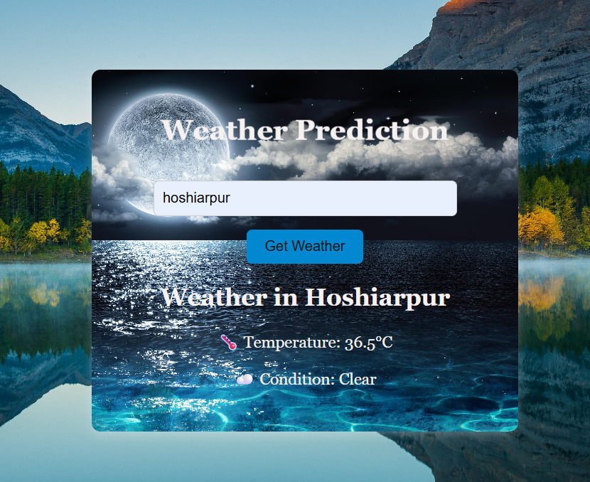

# Weather Prediction Project 🌦️

Weather Prediction is a web application that provides weather information based on the searched city.

## Features
- Real-time weather updates
- Search weather by city
- Temperature, humidity, and wind details
- Responsive and user-friendly interface
- Dynamic weather display

## Technologies Used
- HTML
- CSS
- JavaScript
- Weather API

## Installation

```bash
Open index.html
```

## Project Screenshots

## Project Screenshots

### Welcome Page


### Search Weather


### Weather Result



## GitHub Repository
https://github.com/SimranBadwal2006/Weather-Prediction-Project